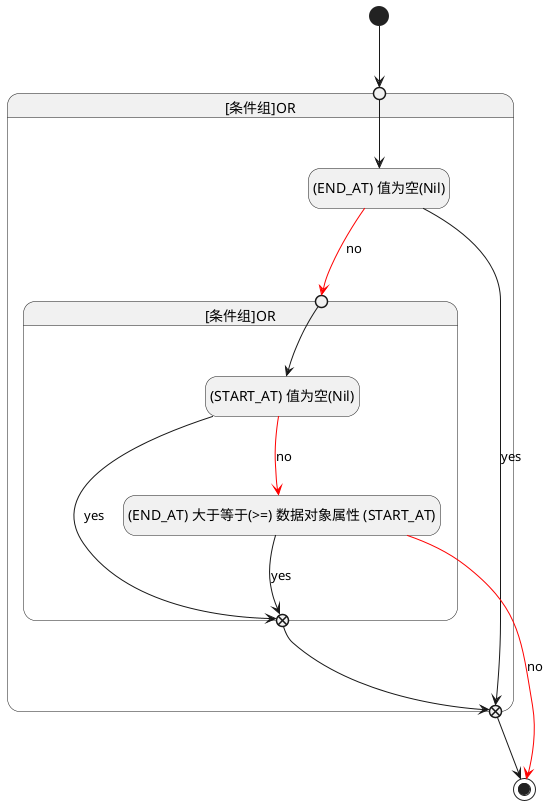

## 结束时间(END_AT) <!-- {docsify-ignore-all} -->

   

### 结束时间 :id=END_AT

#### 条件说明

##### (END_AT) 大于等于(>=) 数据对象属性 (START_AT) :id=ad4de55e7c6502d440ce557ee7d1db7cb

`END_AT(结束时间)` GTANDEQ  `START_AT`

> [!ATTENTION|label:规则信息|icon:fa fa-warning]
> 结束时间必须大于等于开始时间

##### (END_AT) 值为空(Nil) :id=a4d81cff50eacf489a0e38d20a65e2b3d

`END_AT(结束时间)` ISNULL 

##### (START_AT) 值为空(Nil) :id=a4d0175698039d5e88199129c29311bd8

`START_AT(开始时间)` ISNULL 

