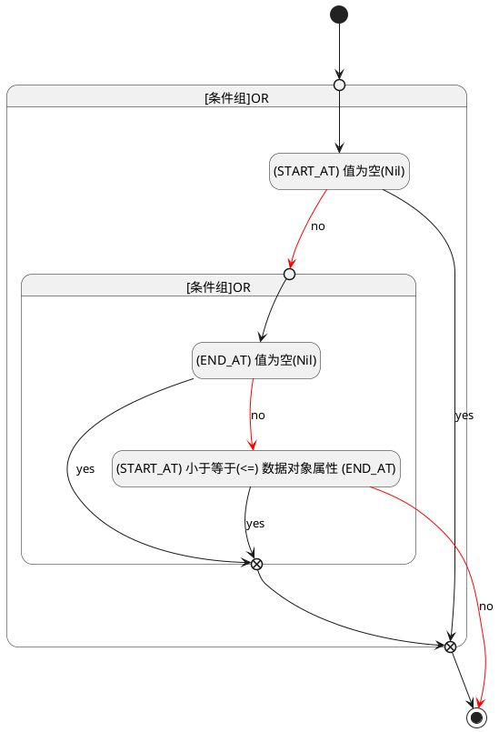

## 开始时间(START_AT) <!-- {docsify-ignore-all} -->

   

### 开始时间 :id=START_AT

#### 条件说明

##### (START_AT) 值为空(Nil) :id=a133e3cead5a76620e018a82ac99c60ea

`START_AT(开始时间)` ISNULL 

##### (START_AT) 小于等于(<=) 数据对象属性 (END_AT) :id=a5f53a51a36b142f488804dcbd3d5288e

`START_AT(开始时间)` LTANDEQ  `END_AT`

> [!ATTENTION|label:规则信息|icon:fa fa-warning]
> 开始时间必须小于等于结束时间

##### (END_AT) 值为空(Nil) :id=a121548d05770cd062044a903c3e41d96

`END_AT(结束时间)` ISNULL 

