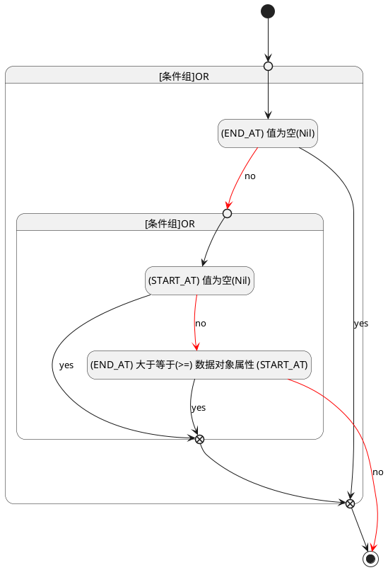

## 结束时间(END_AT) <!-- {docsify-ignore-all} -->

   

### 结束时间 :id=END_AT

#### 条件说明

##### (START_AT) 值为空(Nil) :id=a9ac536c0fcfb6fbfe5bb53249f3fe18e

`START_AT(开始时间)` ISNULL 

##### (END_AT) 大于等于(>=) 数据对象属性 (START_AT) :id=aa9c937651d131d131f550cc9547a20ba

`END_AT(结束时间)` GTANDEQ  `START_AT`

> [!ATTENTION|label:规则信息|icon:fa fa-warning]
> 结束时间必须大于等于开始时间

##### (END_AT) 值为空(Nil) :id=ae32db8c1e1d00f016380e2801fcb6dd2

`END_AT(结束时间)` ISNULL 

