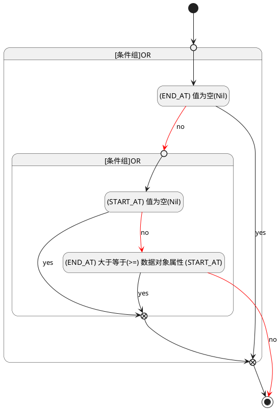

## 结束时间(END_AT) <!-- {docsify-ignore-all} -->

   

### 结束时间 :id=END_AT

#### 条件说明

##### (START_AT) 值为空(Nil) :id=abd98310a24504c87df890af1d83c0523

`START_AT(开始时间)` ISNULL 

##### (END_AT) 值为空(Nil) :id=a3dca7a19f674cd9244f983ecc790c1f7

`END_AT(结束时间)` ISNULL 

##### (END_AT) 大于等于(>=) 数据对象属性 (START_AT) :id=a81921b82ad71a201ce8b1bd2dbb9128e

`END_AT(结束时间)` GTANDEQ  `START_AT`

> [!ATTENTION|label:规则信息|icon:fa fa-warning]
> 结束时间必须大于等于开始时间

